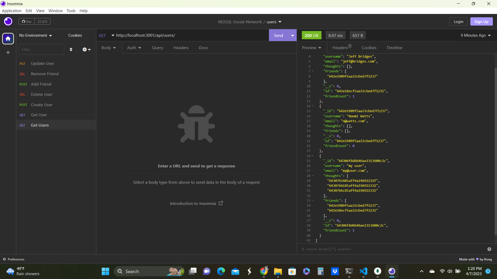

# nosql-social-network-api
An database that uses MongoDB and Express router to store data and an API to set and retrieve it checked routes in Insomnia
Walk through video ends showing there are no more thoughts as all thoughts had been assigned to one user and that user was deleted, deleting all of their thoughts with it

- Used node to rund a server.js file to create and view a database
- Used Mongoose to interact with MongoDB
- Used npm to bring in packages for Express and Mongoose
- Used a file struture with confix, constrollers, models, routes and a server
- Created a video walkthrough of the functionality
- Created a README.md

## Link to Project REPO

[https://github.com/vanwykkim/nosql-social-network-api]

## To Run
node server.js

Uses mongodb compass and Insomnia to view functionality
## Credits

mongoose, mongodb, mongocompass, insomnia
## License

Please refer to the LICENSE in the repo.

##Screenshot

## Video of project
[https://drive.google.com/file/d/1qC-t_S9oauKKs80nkqK4RaynJOpuWilu/view]
